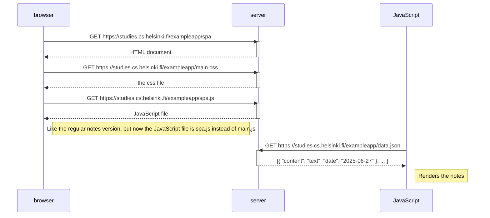

```mermaid
sequenceDiagram
    participant browser
    participant server

    browser->>server: GET https://studies.cs.helsinki.fi/exampleapp/spa
    activate server
    server-->>browser: HTML document
    deactivate server

    browser->>server: GET https://studies.cs.helsinki.fi/exampleapp/main.css
    activate server
    server-->>browser: the css file
    deactivate server

    browser->>server: GET https://studies.cs.helsinki.fi/exampleapp/spa.js
    activate server
    server-->>browser: JavaScript file
    deactivate server

    Note right of browser: Like the regular notes version, but now the JavaScript file is spa.js instead of main.js
    
    participant JavaScript
    JavaScript->>server: GET https://studies.cs.helsinki.fi/exampleapp/data.json
    activate server
    server-->>JavaScript: [{ "content": "text", "date": "2025-06-27" }, ... ]
    deactivate server    

    Note right of JavaScript: Renders the notes
```